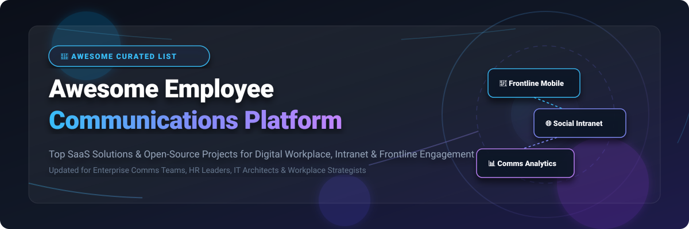

  
  
  
  
  
  

# 📢 Awesome Employee Communications Platform

> **A curated list of top SaaS solutions and open-source GitHub projects for Employee Communications, Digital Workplace, Frontline Connectivity, Social Intranets, and Enterprise Engagement.**

Welcome to the definitive resource for **Employee Communications Platforms (ECP)**, **Digital Workplace Solutions**, and **Corporate Social Intranets**. Designed for internal communications leaders, HR executives, IT architects, and digital workplace strategists, this repository provides data-driven comparisons of leading commercial SaaS software and self-hosted open-source software.

---

## 📑 Table of Contents

- [📊 Market Overview \& Insights](#-market-overview--insights)
- [🏢 SaaS \& Hosted Platforms](#-saas--hosted-platforms)
- [🔓 Open-Source GitHub Projects](#-open-source-github-projects)
- [🛠️ Integration \& Architecture Recommendations](#%EF%B8%8F-integration--architecture-recommendations)
- [🤝 How to Contribute](#-how-to-contribute)
- [📈 Star History](#-star-history)
- [☕ Support \& Sponsorship](#-support--sponsorship)
- [⚠️ Disclaimer](#%EF%B8%8F-disclaimer)

---

## 📊 Market Overview & Insights

> **📈 Sector Market Size & Dynamics**: The global **Employee Communications & Engagement Software Market** is estimated at **$1.8 Billion – $2.5 Billion** and is projected to grow at a CAGR of **~11.4% through 2030**. Market structure: The sector is **moderately fragmented**, undergoing strategic private equity consolidation (e.g., Zoom acquiring Workvivo, LumApps acquiring Beekeeper, CVC backing Unily) while being driven by rapid innovation in AI-powered personalized newsletters, mobile-first frontline worker apps, and open-source workspace suites.

---

## 🏢 SaaS & Hosted Platforms

Below is a comparison of top proprietary Employee Communications SaaS solutions, sorted by **Company Size / Valuation / Revenue** in descending order.

| 🏢 Product | 📝 Description & Key Features | 💵 Pricing (Starting Tier) | 🎁 Free Tier / Trial Limits | 📊 Company Size / Valuation / Revenue |
| :--- | :--- | :--- | :--- | :--- |
| **[Staffbase](https://staffbase.com/)** | 📱 AI-native enterprise employee experience platform with multichannel communication, mobile app, intranet, and frontline reach. | Starts at **$8.00 / user / month** (min. $10,000 / year base fee) | 0-day free trial (Custom interactive demo environment upon request) | **$1.1B Valuation** (~$193M ARR, 2,000+ enterprise clients) |
| **[Haiilo](https://www.haiilo.com/)** | 🌐 Multi-channel employee engagement and social intranet platform (merger of COYO, Smarp & Jubiwee) with advocacy tools. | Starts at **€4.00 / user / month** (~$4.50 / user / month) | 14-day free trial (Available for select modules upon demo request) | **$1.0B Valuation** (~$113M ARR) |
| **[Simpplr](https://www.simpplr.com/)** | 🧠 AI-powered employee experience platform offering smart intranet, enterprise search, and automated internal campaign analytics. | Starts at **$8.00 / user / month** (min. $12,000 / year contract) | 14-day free trial (Guided sandbox environment available upon request) | **$547M Valuation** (~$86M ARR, $131M total funding) |
| **[Unily](https://www.unily.com/)** | ⚡ Enterprise digital workplace and employee intranet trusted by global brands for targeted multi-channel campaign management. | Starts at **£6.00 / user / month** (~$8.00 / user / month, min. $25k/yr) | 0-day free trial (Personalized enterprise demo sandbox upon request) | **~$500M Valuation** (~$58M ARR, CVC Capital backed) |
| **[Workvivo](https://www.workvivo.com/)** *(by Zoom)* | 🎥 Zoom-integrated social intranet & employee app combining workplace news, community feeds, and broadcast messaging. | Starts at **$5.00 / user / month** (min. $20,000 / year enterprise tier) | 0-day free trial (Custom interactive demo environment via Zoom sales) | **$270M Acquisition Value** ($100M+ ARR) |
| **[Firstup](https://firstup.io/)** | 🚀 Intelligent workforce communication platform delivering automated orchestration and engagement analytics across HR channels. | Starts at **$6.00 / user / month** (min. $15,000 / year contract) | 0-day free trial (Custom interactive demo environment upon request) | **$127M Funding** ($100M+ ARR, 15M+ active users) |
| **[Poppulo](https://poppulo.com/)** | 📰 Enterprise internal comms platform featuring targeted email campaigns, digital signage integration, and engagement tracking. | Starts at **$3,500 / year base** (~$3.00 / user / month) | 0-day free trial (Customized live product demo upon request) | **$140M Valuation** ($104M ARR, 6,000+ enterprise clients) |
| **[BeeKeeper](https://www.beekeeper.io/)** | 👷 Mobile-first operational communications platform engineered for deskless and frontline workforce operations. | Starts at **$4.00 / user / month** (Operational Suite base tier) | 14-day free trial (Up to 30 team members) | **$171M Total Funding** (~$72M ARR, Acquired by LumApps) |
| **[Interact Software](https://www.interactsoftware.com/)** | 🏰 Mature intranet software providing corporate news distribution, knowledge bases, and employee directory management. | Starts at **£7.00 / user / month** (~$9.00 / user / month, min. $18k/yr) | 14-day guided trial (Available upon sales request) | **~$150M Est. Valuation** (~$35M ARR) |
| **[Flip](https://flipapp.com/)** | 🔒 Frontline worker communication app with encrypted messaging, shift schedule delivery, and corporate news feed. | Starts at **€3.50 / user / month** (~$4.00 / user / month) | 14-day free trial (Up to 50 employees) | **~$35M Total Funding** (~$20M ARR) |

---

## 🔓 Open-Source GitHub Projects

Open-source digital workplace tools and self-hosted communication platforms offer total data sovereignty, zero per-seat licensing fees, and extensibility. Below are the top open-source projects ranked by **GitHub Stars (Descending)**.

| 🌟 Stars | 📦 Repository & Project | 📜 License | 💡 Overview & Use Case |
| :---: | :--- | :---: | :--- |
|  | **[usememos/memos](https://github.com/usememos/memos)** | MIT | 📝 Lightweight, privacy-first open-source microblogging and internal memo platform for quick team broadcasts and knowledge sharing. |
|  | **[discourse/discourse](https://github.com/discourse/discourse)** | GPL-2.0 | 💬 Modern open-source community and internal discussion forum designed for long-form asynchronous employee communication and Q&A. |
|  | **[RocketChat/Rocket.Chat](https://github.com/RocketChat/Rocket.Chat)** | MIT | 💬 Enterprise open-source chat and team collaboration suite featuring channels, matrix federation, omni-channel support, and video calls. |
|  | **[outline/outline](https://github.com/outline/outline)** | BSL-1.1 | 📚 Fast, modern open-source wiki and internal documentation platform for employee onboarding, policies, and knowledge bases. |
|  | **[novuhq/novu](https://github.com/novuhq/novu)** | MIT | 🔔 Open-source notification infrastructure to build multi-channel internal broadcast systems (Email, SMS, Push, Slack, Webhooks). |
|  | **[mattermost/mattermost](https://github.com/mattermost/mattermost)** | MIT | 🛡️ Secure, self-hosted team communication platform built for high-security environments, air-gapped networks, and DevSecOps teams. |
|  | **[jitsi/jitsi-meet](https://github.com/jitsi/jitsi-meet)** | Apache-2.0 | 📹 WebRTC-based open-source video conferencing solution for internal company meetings, all-hands broadcasts, and team huddles. |
|  | **[hcengineering/platform](https://github.com/hcengineering/platform)** *(Huly)* | AGPL-3.0 | 🏢 All-in-one open-source digital workplace combining team chat, task management, document collaboration, and virtual office spaces. |
|  | **[zulip/zulip](https://github.com/zulip/zulip)** | Apache-2.0 | 🧵 Threaded real-time team chat software that organizes conversations by stream and topic for efficient asynchronous communication. |
|  | **[knadh/listmonk](https://github.com/knadh/listmonk)** | AGPL-3.0 | ✉️ High-performance self-hosted newsletter manager built in Go with Vue frontend; ideal for automated internal HR updates & newsletters. |
|  | **[element-hq/element-web](https://github.com/element-hq/element-web)** | Apache-2.0 | 🔐 Secure, decentralized Matrix-based messaging client for enterprise end-to-end encrypted employee communication. |
|  | **[matrix-org/synapse](https://github.com/matrix-org/synapse)** | AGPL-3.0 | 🌐 Reference Matrix homeserver implementation providing federated, secure communication backbone for large organizational networks. |
|  | **[humhub/humhub](https://github.com/humhub/humhub)** | BSD-3-Clause | 👥 Flexible open-source corporate social network & intranet platform with spaces, user profiles, polls, modules, and file sharing. |
|  | **[nextcloud/spreed](https://github.com/nextcloud/spreed)** | AGPL-3.0 | 📞 Nextcloud Talk module providing end-to-end encrypted chat, video calls, and screen sharing integrated with Nextcloud files & calendar. |
|  | **[exoplatform/platform](https://github.com/exoplatform/platform)** | AGPL-3.0 | 🏛️ Comprehensive digital workplace platform featuring social intranet, activity feeds, document management, wiki, and mobile apps. |
|  | **[mydnic/kanpen](https://github.com/mydnic/kanpen)** | MIT | 📧 Laravel-based campaign manager for handling scheduled internal communications, open tracking, and custom email Blade templates. |

---

## 🛠️ Integration & Architecture Recommendations

Unlike consumer software, employee communication platforms must integrate smoothly into existing enterprise IT infrastructure:

1. **Self-Hosted Complete Stack**: Combine **HumHub** or **eXo Platform** (Intranet CMS), **Mattermost** or **Zulip** (Real-time Team Chat), **listmonk** (Internal Email Broadcasts), and **Outline** (Policy & Wiki Docs).
2. **Identity & Single Sign-On (SSO)**: Connect open-source systems via **OpenID Connect (OIDC)**, **SAML 2.0**, or **Keycloak / LDAP / Active Directory** to manage automated employee provisioning and offboarding.
3. **Frontline Worker Reach**: For deskless staff, prioritize solutions offering native iOS/Android apps with mobile push notifications and SMS fallback capabilities (**Staffbase**, **BeeKeeper**, **Flip**, or **Rocket.Chat**).

---

## 🤝 How to Contribute

Contributions are warmly welcomed! Help us keep this list comprehensive and up to date:

1. 🍴 **Fork** this repository.
2. 📝 Add or update an entry in `README.md` following the table formats.
3. 📌 Ensure descriptions are factual, link to official sites/repos, and include accurate licensing/pricing details.
4. 🚀 Submit a **Pull Request** with a clear explanation of your additions.

Please check out our list of awesome lists at [Awesome-Awesome-Awesome](https://github.com/ishandutta2007/Awesome-Awesome-Awesome)!

---

## 📈 Star History

---

## ☕ Support & Sponsorship

If you find this curated list valuable for your organization, digital workplace research, or vendor selection process, please consider supporting the project:

- ⭐ **Star this repository** to help others discover it!
- 🍴 **Fork it** to maintain your custom workplace stack notes.
- 📢 **Share it** with your HR, IT, and internal comms networks.
- 💖 **Sponsor / Buy me a coffee**: Support ongoing updates on the [GitHub Sponsor Dashboard](https://github.com/sponsors/ishandutta2007).

Thank you for supporting open workplace communications!

---

## ⚠️ Disclaimer

- This repository is a **community-curated list** for informational and educational purposes only.
- Financial metrics (ARR, valuations) for private SaaS companies are based on publicly reported industry data, venture reports, and market research.
- Always perform your own IT governance, GDPR/CCPA compliance, and security audits before deploying software that handles internal corporate data.

---

  <b>Made with ❤️ for internal communications teams, HR leaders, IT administrators, and workplace strategists worldwide.</b>

